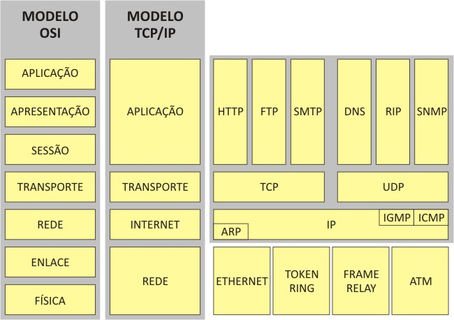

# COM130 - Fundamentos de Internet e Web

Apresentar noções sobre a estrutura de documentos na Web:
- Hipertexto; 
- Origens de XML e HTML (SGML); 
- Estrutura do conteúdo versus aparência do documento; 
- Tags HTML básicas (H1, P etc.) e extensíveis (div, span etc.);
- Atributos básicos de CSS (color, text-align etc.), seletores CSS; 
- Javascript;
- Formulários HTML; 
- Noções de manipulação programática do DOM. 

## Exercícios práticos:

Relacionei os exercícios realizados no 4º bimestre/2020 durante as aulas da disciplina COM130 do Curso de Bacharel de Ciência de Dados da Univesp. Abaixo segue uma breve descrição do problema de negócios e da solução (o link direciona para o código):

1. [Tabelas](tables.html): Implementar uma lista telefônica em uma estrutura em estrutura de tabela em HTML5;
2. [Marcadores HTML](Sem4_aula1.html): Criar uma página com as tags h1 .. h6, p, aside, dfn, svg, blockquote, listas, article, a, footer;
3. [Converter divs em HTML5](div_TO_html5/): dada uma página formatada com _div_ use as tags HTML5 que correspondam a estrutura CSS adequada;
4. [Site de eletrônicos](tv/): criar uma estrutura HTML5 com CSS que contemple 2 páginas de navegação para apresentação de equipamento eletrônico;
5. [Layout com CSS - comercial](layout.html): estrtura de uma página web com _section_ contendo links externos na forma de menu _nav_, espaço para _ads_, _article_, _aside_ e _footer_;
6. [Layout com CSS - currículo](cv/): estrtura de uma página web com _section_ contendo tabelas para apresentação curricular de um aluno e formulário para contato;
7. [Resumo das TAGs HTML5](resumo_tags_html5.html): descrever resumidamente todas as tags html5 estudadas no curso.
8. [Java script](search/): criação de script para localização de conteúdo.

## Modelo estrutural das camadas da Internet (protocolos)

  

